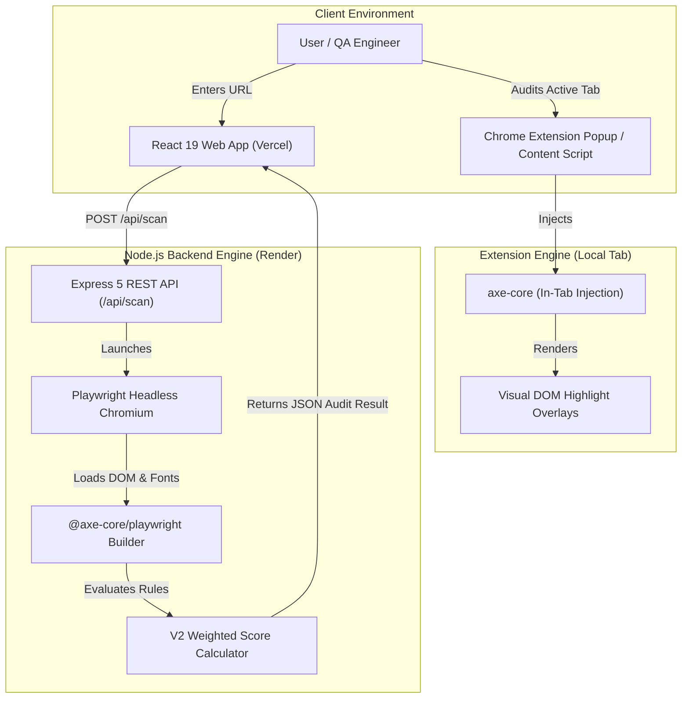

<div align="center">

  <h1>🌐 Accessibility Auditor</h1>
  <p><strong>Automated Web Accessibility Suite & Real-Time Chrome Extension</strong></p>

  <p>
    An end-to-end open-source toolkit for auditing websites against <strong>WCAG 2.1 & 2.2 (Level A, AA, AAA)</strong> standards. Powered by <strong>axe-core</strong>, <strong>Playwright</strong>, <strong>React 19</strong>, and <strong>Node.js</strong>.
  </p>

  <p>
    <a href="https://accessibility-checker-vert.vercel.app/"><strong>🚀 View Live Web App</strong></a> •
    <a href="https://github.com/skdevane/Accessibility-Checker/releases/latest/download/accessibility-extension.zip"><strong>🧩 Download Chrome Extension (.zip)</strong></a> •
    <a href="#-getting-started"><strong>📖 Local Setup Guide</strong></a>
  </p>

  <!-- Badges -->
  <p>
    
    
    
    
    
  </p>

</div>

---

## 📌 Overview

**Accessibility Auditor** is built to help developers, accessibility engineers, and QA teams identify, diagnose, and remediate digital accessibility barriers before production. 

It combines two powerful auditing modes:
1. **Automated Web Scanner**: A full-stack web application that uses headless **Playwright Chromium** to render dynamic web pages, wait for font/widget stabilization, and evaluate DOM trees using `axe-core`.
2. **Real-Time Chrome Extension**: A lightweight browser extension that injects directly into active tabs, highlighting WCAG violations on-screen with visual overlays and failure summaries.

---

## ✨ Key Features

* **⚡ Real-Time In-Browser Auditing**: Scan any active tab instantly via the Chrome Extension without requiring backend dependencies.
* **🌐 Dynamic SPA & Font Stabilization**: Playwright engine waits for network idle state, custom web fonts, and dynamic popups to settle for accurate color contrast checks.
* **📊 Granular Severity Scoring**: Categorizes issues into **Critical**, **Serious**, **Moderate**, and **Minor** with a weighted 0–100 overall score.
* **🎯 Precise DOM Node Mapping**: Displays CSS selectors, offending HTML snippets, WAI-ARIA tag requirements, and direct W3C WCAG quickref links.
* **📖 Built-In Extension Guide**: Includes an in-app WCAG 2.1 AA compliant page with step-by-step instructions for loading unpacked extensions.
* **🔒 100% Local & Private**: Audits execute inside isolated sandboxes with zero analytical tracking or third-party data telemetry.

---

## 🛠️ Tech Stack & Technologies

### **Frontend & UI**
<p>
  
  
  
  
</p>

### **Backend & Auditing Engine**
<p>
  
  
  
  
  
</p>

### **DevOps & Deployment**
<p>
  
  
  
</p>

---

## 🏗️ Architecture



---

## 📁 Repository Structure

```text
Accessibility-Checker/
├── .github/
│   └── workflows/
│       └── deploy-and-release.yml    # Auto-packages & creates GitHub Extension Releases
├── backend/
│   ├── src/
│   │   ├── engine/
│   │   │   ├── scanWithBrowser.ts    # Playwright & axe-core runner
│   │   │   ├── scoreCalculatorV2.ts  # Weighted scoring algorithm
│   │   │   ├── fetchPage.ts          # Static HTML fetcher
│   │   │   └── runRules.ts           # Cheerio static rule engine
│   │   ├── routes/
│   │   │   └── scan.ts               # POST /api/scan REST endpoint
│   │   ├── rules/                    # Custom static WCAG rule sets
│   │   └── server.ts                 # Express 5 entry point (Port 3002)
│   └── package.json
├── extension/
│   ├── src/
│   │   ├── content/                  # Injected DOM scanner script
│   │   └── popup/                    # Extension UI popup window
│   ├── popup.html
│   └── vite.config.ts                # CRX bundle build config
├── frontend/
│   ├── src/
│   │   ├── components/
│   │   │   ├── ExtensionPage.tsx     # WCAG-compliant Extension download page
│   │   │   ├── ScanForm.tsx          # Accessible URL submission form
│   │   │   ├── ScanProgress.tsx      # Smooth progress ticker & status messages
│   │   │   ├── ScoreCard.tsx         # Audit summary dashboard card
│   │   │   └── ViolationGroup.tsx    # Detailed WCAG issue list & code snippets
│   │   ├── App.tsx                   # Main layout & navigation tab switcher
│   │   └── main.tsx
│   └── vite.config.ts                # Vite dev server (Port 5173 + API proxy)
├── render.yaml                       # Render.com backend deployment blueprint
├── vercel.json                       # Vercel frontend build configuration
└── README.md
```

---

## 🚀 Getting Started

### Prerequisites
* **Node.js**: `v18.0.0` or higher
* **npm**: `v9.0.0` or higher

### 1. Clone the Repository
```bash
git clone https://github.com/skdevane/Accessibility-Checker.git
cd Accessibility-Checker
```

### 2. Start the Backend API
```bash
cd backend
npm install
npm run dev
```
The Express API will start on **`http://localhost:3002`**.

### 3. Start the Frontend Dashboard
In a new terminal window:
```bash
cd frontend
npm install
npm run dev
```
Open **`http://localhost:5173`** in your browser.

---

## 🧩 Installing the Chrome Extension

1. Download the pre-built release package: [**`accessibility-extension.zip`**](https://github.com/skdevane/Accessibility-Checker/releases/latest/download/accessibility-extension.zip).
2. Extract the `.zip` archive on your computer.
3. Open Google Chrome / Brave / Edge and navigate to `chrome://extensions`.
4. Enable **Developer mode** (top-right toggle switch).
5. Click **Load unpacked** and select the extracted extension folder.
6. Click the extension icon on any live website to audit in real-time!

---

## 📐 Evaluated WCAG Rule Categories

| Category | WCAG Criteria Covered | Checks Performed |
| :--- | :--- | :--- |
| **Images & Media** | WCAG 1.1.1, 1.4.3 | Missing `alt` text, decorative images, autoplaying video/audio media. |
| **Forms & Labels** | WCAG 1.3.1, 3.3.2 | Explicit `<label>` associations, empty `<button>` tags, `<fieldset>` legends. |
| **Page Structure** | WCAG 1.3.1, 2.4.1 | Heading hierarchy (`<h1>`–`<h6>`), `<main>` landmark presence, skip navigation links. |
| **Keyboard & Focus** | WCAG 2.1.1, 2.4.7 | Focusable element visibility, positive `tabindex` anti-patterns, ARIA hidden focus traps. |
| **Language & Document** | WCAG 3.1.1 | Valid HTML `lang` attributes, page title presence. |
| **Links & Navigation** | WCAG 2.4.4 | Non-descriptive link text (*"click here"*, *"read more"*), broken href targets. |
| **Tables & Frames** | WCAG 1.3.1, 4.1.2 | `<iframe>` accessible titles, `<th>` header scope bindings. |

---

## 🤝 Contributing

Contributions, issues, and feature requests are welcome!
Feel free to check the [issues page](https://github.com/skdevane/Accessibility-Checker/issues).

1. Fork the Project
2. Create your Feature Branch (`git checkout -b feature/AmazingFeature`)
3. Commit your Changes (`git commit -m 'Add some AmazingFeature'`)
4. Push to the Branch (`git push origin feature/AmazingFeature`)
5. Open a Pull Request

---

## 📜 License

Distributed under the **MIT License**. See `LICENSE` for more information.

<div align="center">
  <sub>Built by <a href="https://github.com/skdevane">Shivkumar Devane</a> for an accessible web for everyone.</sub>
</div>
